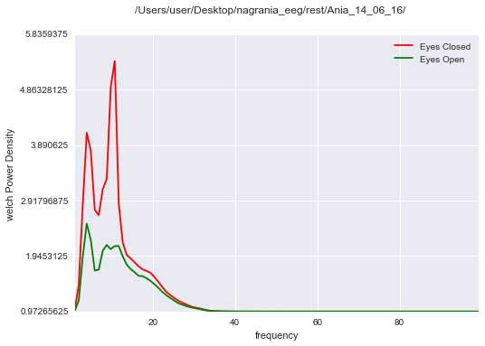
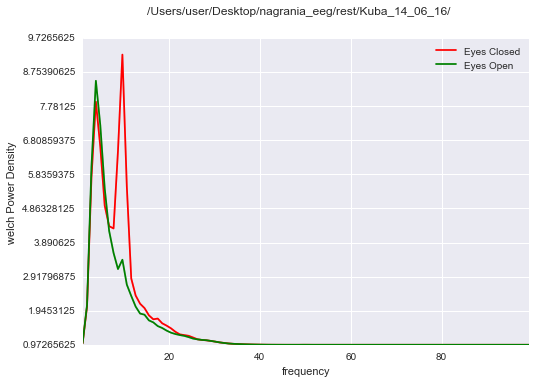
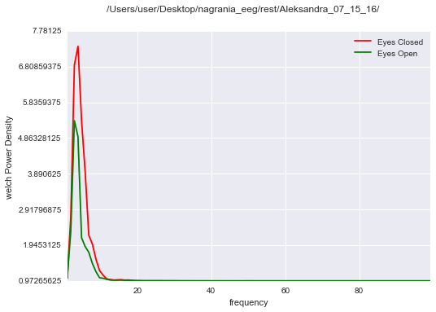
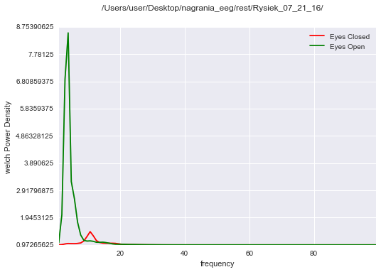
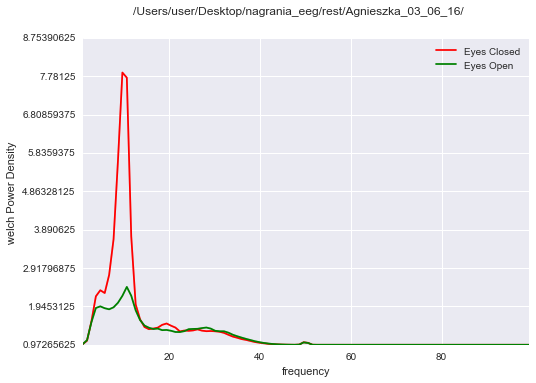
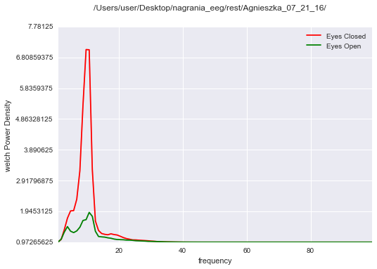

Resting State
-------------

.. code:: python

    # Notebook settings (i.e. this thing settings) 
    %matplotlib inline
    #%matplotlib notebook 
    #Change to %matplotlib notebook to be able to zoom, pan, etc the figures,
    #inline is only used so the notebook can be exported to .rst format and hosted on readthedocs
    %load_ext autoreload
    %autoreload 2 

.. parsed-literal::

    The autoreload extension is already loaded. To reload it, use:
      %reload_ext autoreload

.. code:: python

    # Documentation at: http://pyseries.readthedocs.io/en/latest/
    
    # To use last version of pyseries enter in the terminal (pip installation: https://pip.pypa.io/en/stable/installing/)
    # >>> pip install pyseries 
    
    # To use use pyseries locally from downloaded github repo (when you want to make changes to source code),
    # 1) pip uninstall pyseries 
    # 2) checkout https://github.com/ryscet/pyseries.git (tutorial: https://help.github.com/articles/fetching-a-remote/)
    # 3) uncomment below and put a correct path 
    
    import sys
    sys.path.insert(0, '/Users/user/Desktop/repo_for_pyseries/pyseries/')

.. code:: python

    
    import pyseries.LoadingData as loading
    import pyseries.Preprocessing as prep
    import pyseries.Analysis as analysis

.. code:: python

    def plot_rest():
        paths = [   '/Users/user/Desktop/nagrania_eeg/rest/Ania_14_06_16/',
                    '/Users/user/Desktop/nagrania_eeg/rest/Karen_14_06_16/',
                    '/Users/user/Desktop/nagrania_eeg/rest/Kuba_14_06_16/',
                    '/Users/user/Desktop/nagrania_eeg/rest/Rysiek_03_06_16/',
                    '/Users/user/Desktop/nagrania_eeg/rest/Aleksandra_07_15_16/',
                    '/Users/user/Desktop/nagrania_eeg/rest/Rysiek_07_21_16/',
                    '/Users/user/Desktop/nagrania_eeg/rest/Aleksandra_07_21_16/',
                    '/Users/user/Desktop/nagrania_eeg/rest/Agnieszka_03_06_16/',
                    '/Users/user/Desktop/nagrania_eeg/rest/Agnieszka_07_21_16/'
                    ]
    
    
        for idx, path in enumerate(paths):
            recording = loading.Read_edf.Combine_EDF_XML(path, 3, 70)
            
            epochs_info= {"Eyes Open": [0, 498*140], "Eyes Closed": [0, 498 *140]}
            
            epochs = prep.Epochs.Make_Epochs_for_Channels(recording, ['EEG O1'],epochs_info)
            
            power_density= analysis.Explore.PlotPowerSpectrum(epochs['EEG O1'], 498, mode = 'welch', name = path, save_path ="/Users/user/Desktop/Figures/rest/" + str(idx) + ".png"   )
    
            #prep.Epochs.mark_events(recording,['EEG O1'], subject_name = path)

.. code:: python

    plot_rest()

.. parsed-literal::

    (497.971446705165,)
    /Users/user/Desktop/nagrania_eeg/rest/Ania_14_06_16/
    (497.971446705165,)
    /Users/user/Desktop/nagrania_eeg/rest/Karen_14_06_16/
    (497.971446705165,)
    /Users/user/Desktop/nagrania_eeg/rest/Kuba_14_06_16/
    (497.971446705165,)
    /Users/user/Desktop/nagrania_eeg/rest/Rysiek_03_06_16/
    (500.0,)
    /Users/user/Desktop/nagrania_eeg/rest/Aleksandra_07_15_16/
    (500.0,)
    /Users/user/Desktop/nagrania_eeg/rest/Rysiek_07_21_16/
    (500.0,)
    /Users/user/Desktop/nagrania_eeg/rest/Aleksandra_07_21_16/
    (497.971446705165,)
    /Users/user/Desktop/nagrania_eeg/rest/Agnieszka_03_06_16/
    (500.0,)
    /Users/user/Desktop/nagrania_eeg/rest/Agnieszka_07_21_16/

.. image:: output_4_2.png

.. image:: output_4_3.png

.. image:: output_4_6.png

