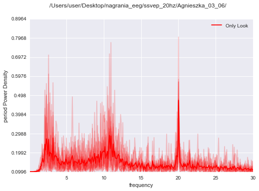

VisuallyEvokedPotentials
--------------------------
.. code:: python

    import sys
    sys.path.insert(0, '/Users/user/Desktop/repo_for_pyseries/pyseries')
    
    import pyseries.LoadingData as loading
    import pyseries.Preprocessing as prep
    import pyseries.Analysis as analysis
    import matplotlib.pyplot as plt
    import seaborn as sns
    import numpy as np
    from scipy import stats
    
    # Notebook settings (i.e. this thing settings)
    %matplotlib inline
    #%matplotlib notebook
    #Change to %matplotlib notebook to be able to zoom, pan, etc the figures,
    #inline is only used so the notebook can be exported to .rst format and hosted on readthedocs
    %load_ext autoreload
    %autoreload 2

.. code:: python

    
    def calc_corr(path):
        #Read single subject data - eeg, info about eeg and info from experimental app (unity)
        recording = loading.Read_edf.Combine_EDF_XML(path, 3, 70)
        #Display markers over the whole signal    
        prep.Epochs.mark_events(recording,['EEG O1'], subject_name = path)
    
        #Define epochs for analysis
        epochs_info= {"Please Count": [0, 500*10], "Only Look": [0, 500 *10]}
        #Create them by slicing the signal
        epochs = prep.Epochs.Make_Epochs_for_Channels(recording, ['EEG O1','EEG O2','EEG P3', 'EEG P4'],epochs_info)
        #Re-reference, because only by subtracting P from O-electrodes ssvep response becomes visible
        new_ref = {}
        new_ref['Only Look'] = epochs ['EEG O2']['Only Look'] - epochs['EEG P4']['Only Look']
        new_ref['Please Count'] = epochs ['EEG O2']['Please Count'] - epochs ['EEG P4']['Please Count']
        new_epochs  = {"O-P":new_ref}
        
        #Get the accuracy in counting condition
        responses = recording['events'][recording['events']["code"] == "responded"]
        accuracy = responses['response'] / responses['expected']
        
        #Get the power spectra in two conditions       
        power_density= analysis.Explore.PlotPowerSpectrum(new_epochs['O-P'], 498, mode = 'period', name = path, freq_min = 0, freq_max = 20)
        
        ssvep = analysis.Normalize.Z_score( power_density['Please Count'][1][:,49] )
        accuracy = analysis.Normalize.Z_score( accuracy )
        
        return ssvep, accuracy, power_density
        

.. code:: python

    
    def plot_slow_ssvep():
        #Slow is 5Hz flicker
        paths = ['/Users/user/Desktop/nagrania_eeg/ssvep/Blazej_13_06_16/',
                '/Users/user/Desktop/nagrania_eeg/ssvep/Ania_14_06_16/',
                '/Users/user/Desktop/nagrania_eeg/ssvep/Karen_14_06_16/',
                '/Users/user/Desktop/nagrania_eeg/ssvep/Agnieszka_03_06/',
                '/Users/user/Desktop/nagrania_eeg/ssvep/Kuba_14_06_16/',
                '/Users/user/Desktop/nagrania_eeg/ssvep/Rysiek_03_06/'
                ]
    
        all_ssvep = []
        all_acc = []
        
        saving = {}
        for p in paths:
            ssvep, acc, pxx = calc_corr(p)
            all_ssvep.extend(ssvep)
            all_acc.extend(acc)
            
            saving[p] = ssvep
        
        sns.jointplot(x = np.array(all_ssvep),y =  np.array(all_acc), kind="reg")
        return saving

.. code:: python

    
    def plot_fast_ssvep():
        #fast is 20 Hz flicker
        paths = ['/Users/user/Desktop/nagrania_eeg/ssvep_20hz/Agnieszka_03_06/', 
                 '/Users/user/Desktop/nagrania_eeg/ssvep_20hz/Rysiek_03_06/']
    
        for path in paths:
        
            #Read single subject data - eeg, info about eeg and info from experimental app (unity)
            recording = loading.Read_edf.Combine_EDF_XML(path, 0, 70)
            #Define epochs for analysis
            epochs_info= {"Only Look": [0, 500 *10]}
            #Create them by slicing the signal
            epochs = prep.Epochs.Make_Epochs_for_Channels(recording, ['EEG O1','EEG O2','EEG P3','EEG P4'],epochs_info)
            #Re-reference, because oonly then ssvep response becomes visible
            new_ref = {}
            new_ref['Only Look'] = epochs ['EEG O2']['Only Look'] - epochs['EEG P4']['Only Look']
            new_epochs  = {"O-P":new_ref}
                    
            #Get the power spectra in two conditions       
            power_density= analysis.Explore.PlotPowerSpectrum(new_epochs['O-P'], 498, mode = 'period', name = path, freq_min = 0, freq_max = 30)
        

.. code:: python

    plot_slow_ssvep()

.. parsed-literal::

    Channels:
    EEG F3
    EEG F4
    EEG P3
    EEG P4
    EEG O1
    EEG O2
    EEG T6
    EEG A2
    EEG Pz
    (497.971446705165,)
    /Users/user/Desktop/nagrania_eeg/ssvep/Blazej_13_06_16/
    Channels:
    EEG Fp1
    EEG F3
    EEG F4
    EEG C3
    EEG C4
    EEG P3
    EEG P4
    EEG O1
    EEG O2
    EEG T5
    EEG T6
    EEG Pz
    S1
    S2
    (497.971446705165,)
    /Users/user/Desktop/nagrania_eeg/ssvep/Ania_14_06_16/
    Channels:
    EEG Fp1
    EEG F3
    EEG F4
    EEG C3
    EEG C4
    EEG P3
    EEG P4
    EEG O1
    EEG O2
    EEG T3
    EEG T4
    EEG Pz
    S1
    S2
    (497.971446705165,)
    /Users/user/Desktop/nagrania_eeg/ssvep/Karen_14_06_16/
    Channels:
    EEG F3
    EEG F4
    EEG C3
    EEG C4
    EEG P3
    EEG P4
    EEG O1
    EEG O2
    EEG A2
    EEG Cz
    (497.971446705165,)
    /Users/user/Desktop/nagrania_eeg/ssvep/Agnieszka_03_06/
    Channels:
    EEG Fp2
    EEG F3
    EEG F4
    EEG C3
    EEG C4
    EEG P3
    EEG P4
    EEG O1
    EEG O2
    EEG T3
    EEG Fz
    EEG Cz
    S1
    S2
    S3
    S4
    (497.971446705165,)
    /Users/user/Desktop/nagrania_eeg/ssvep/Kuba_14_06_16/
    Channels:
    EEG F3
    EEG F4
    EEG C3
    EEG C4
    EEG P3
    EEG P4
    EEG O1
    EEG O2
    EEG A2
    EEG Cz
    (497.971446705165,)
    /Users/user/Desktop/nagrania_eeg/ssvep/Rysiek_03_06/

.. parsed-literal::

    /Users/user/anaconda/lib/python3.5/site-packages/statsmodels/nonparametric/kdetools.py:20: VisibleDeprecationWarning: using a non-integer number instead of an integer will result in an error in the future
      y = X[:m/2+1] + np.r_[0,X[m/2+1:],0]*1j

.. parsed-literal::

    {'/Users/user/Desktop/nagrania_eeg/ssvep/Agnieszka_03_06/': array([ 1.62312664, -0.64587493, -1.07742191, -0.57539491,  0.6755651 ]),
     '/Users/user/Desktop/nagrania_eeg/ssvep/Ania_14_06_16/': array([-1.88734758,  0.41555267,  1.08925904,  0.2441026 ,  0.13843327]),
     '/Users/user/Desktop/nagrania_eeg/ssvep/Blazej_13_06_16/': array([-1.51988438,  1.45266728, -0.50483657,  0.56995163,  0.00210205]),
     '/Users/user/Desktop/nagrania_eeg/ssvep/Karen_14_06_16/': array([-0.52336364, -0.10604935,  1.53643037,  0.53210927, -1.43912664]),
     '/Users/user/Desktop/nagrania_eeg/ssvep/Kuba_14_06_16/': array([-1.1445404 , -0.02263413, -1.07913341,  1.15506314,  1.09124479]),
     '/Users/user/Desktop/nagrania_eeg/ssvep/Rysiek_03_06/': array([ 0.57460658,  1.19457484, -1.48773301,  0.56278917, -0.84423758])}

.. image:: output_4_3.png

.. image:: output_4_4.png

.. image:: output_4_5.png

.. image:: output_4_6.png

.. image:: output_4_7.png

.. image:: output_4_8.png

.. image:: output_4_9.png

.. image:: output_4_10.png

.. image:: output_4_11.png

.. image:: output_4_12.png

.. image:: output_4_13.png

.. image:: output_4_14.png

.. image:: output_4_15.png

.. code:: python

    plot_fast_ssvep()

.. parsed-literal::

    Channels:
    EEG F3
    EEG F4
    EEG C3
    EEG C4
    EEG P3
    EEG P4
    EEG O1
    EEG O2
    EEG A2
    EEG Cz
    (497.971446705165,)
    /Users/user/Desktop/nagrania_eeg/ssvep_20hz/Agnieszka_03_06/
    Channels:
    EEG F3
    EEG F4
    EEG C3
    EEG C4
    EEG P3
    EEG P4
    EEG O1
    EEG O2
    EEG A2
    EEG Cz
    (497.971446705165,)
    /Users/user/Desktop/nagrania_eeg/ssvep_20hz/Rysiek_03_06/

.. image:: output_5_2.png

