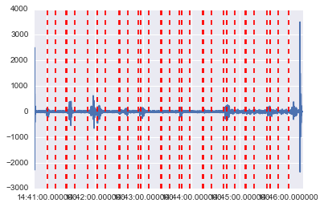
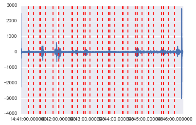
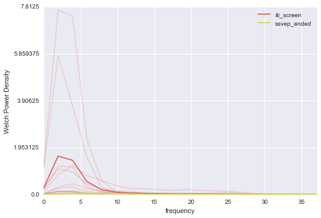
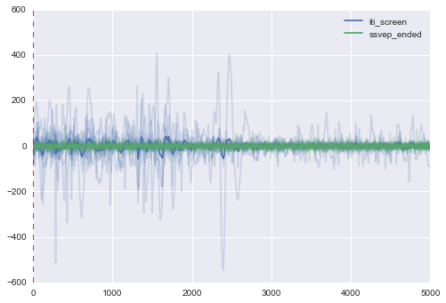

ssvep_pipeline
--------------
.. code:: python

    # Notebook settings (i.e. this thing settings) 
    %matplotlib inline
    #%matplotlib notebook 
    #Change to %matplotlib notebook to be able to zoom, pan, etc the figures,
    #inline is only used so the notebook can be exported to .rst format and hosted on readthedocs
    %load_ext autoreload
    %autoreload 2 

.. parsed-literal::

    The autoreload extension is already loaded. To reload it, use:
      %reload_ext autoreload

.. code:: python

    # Documentation at: http://pyseries.readthedocs.io/en/latest/
    
    # To use last version of pyseries enter in the terminal (pip installation: https://pip.pypa.io/en/stable/installing/)
    # >>> pip install pyseries 
    
    # To use use pyseries locally from downloaded github repo (when you want to make changes to source code),
    # 1) pip uninstall pyseries 
    # 2) checkout https://github.com/ryscet/pyseries.git (tutorial: https://help.github.com/articles/fetching-a-remote/)
    # 3) uncomment below and put a correct path 
    
    #import sys
    #sys.path.insert(0, '/Users/user/Desktop/repo_for_pyseries/pyseries/')

.. code:: python

    import pyseries.LoadingData as loading
    import pyseries.Preprocessing as prep
    import pyseries.Analysis as analysis

.. code:: python

    channels = loading.Read_edf.Combine_EDF_XML('/Users/user/Desktop/Nagrania/ssvep_20hz/Agnieszka_03_06/',True)
    
    n_samples_back = {"iti_screen": 0, "ssvep_ended": 500 * 10}
    n_samples_forth = {"iti_screen":  500* 10, "ssvep_ended": 0}
    
    slices = prep.Epochs.Make_Epochs_for_Channels(channels, ['EEG O1', 'EEG O2',  'EEG P3', 'EEG C4', 'EEG P4'],n_samples_back, n_samples_forth)

.. parsed-literal::

    Channels:
    EEG F3
    EEG F4
    EEG C3
    EEG C4
    EEG P3
    EEG P4
    EEG O1
    EEG O2
    EEG A2
    EEG Cz

.. code:: python

    prep.Epochs.mark_events(channels, ['EEG O1', 'EEG P4', 'EEG C4'])

.. code:: python

    f, pxx = analysis.Explore.PlotPowerSpectrum(slices['EEG C4'])

.. code:: python

    f, pxx = analysis.Explore.PlotPowerSpectrum(slices['EEG O2'])

.. code:: python

    analysis.Explore.PlotErp(slices['EEG O2'], 0)

