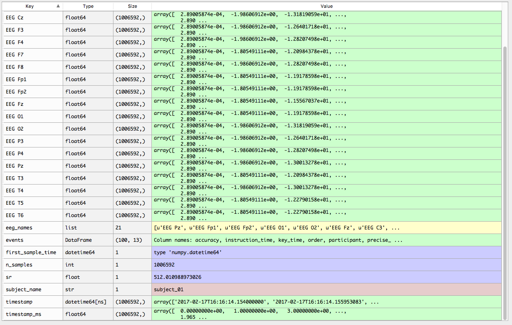
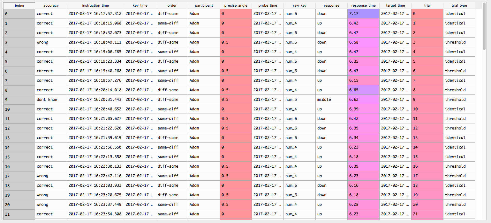

.. _new_documentation:

=============
Documentation
=============

Pyseries uses a dictionary for storing all information collected during the experiment, we will call this dictionary ``recording``. ``Recording`` dictionary contains signal from eeg channels, timestamps, event markers and metadata. A screenshot of recording dictionary taken from spyder is below: 

An important element in ``recording`` dictionary is a pandas dataframe under key ``events``. In ``events`` we store all information about types and timings of events like stimulus appearance or subject responses.

.. toctree::

   ReadData

API
^^^
.. toctree::

   Analysis
   Preprocessing
   ReadData